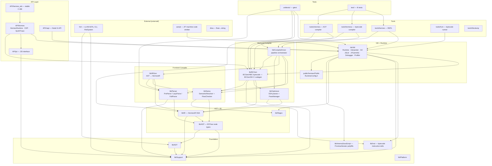
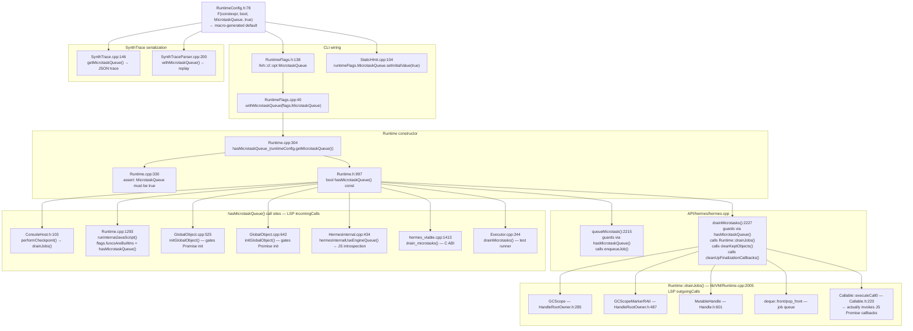
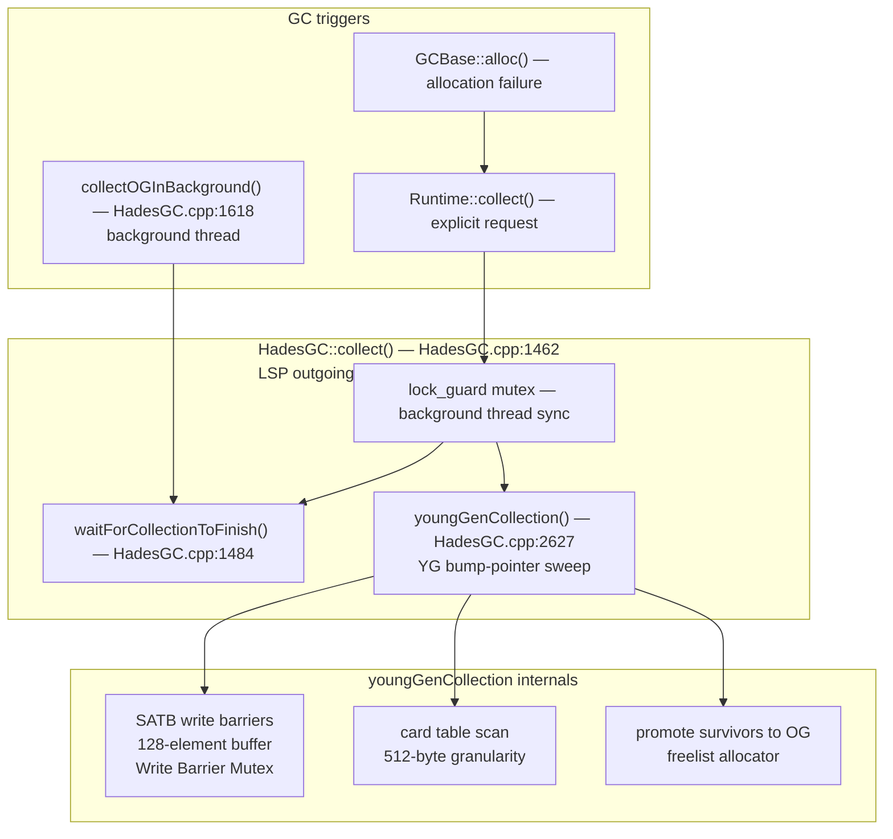
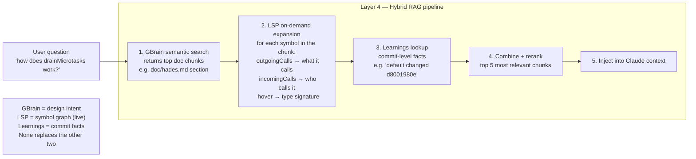

# Hermes Codebase Graph
*#include analysis (grep) + function-level call graph (clangd LSP live queries)*
*Generated 2026-06-03*

> **Two kinds of edges exist in this document.**
> `#include` edges come from grep and show file-level dependencies.
> **Function call edges** come from clangd LSP `outgoingCalls` / `incomingCalls` and show what one function actually invokes inside another module.
> The second kind is what matters for code navigation and impact analysis.

---

## 1 — Module-Level Architecture

---

## 2 — Compiler Pipeline: Function-Level Call Graph

*Every function name here is real and was verified by LSP `outgoingCalls`.*

```mermaid
flowchart LR
    src["source.js"]

    subgraph DRIVER["CompilerDriver::processSourceFiles()\nCompilerDriver.cpp:1959"]
        lex["JSLexer()\nlib/Parser/JSLexer.cpp:81"]
        parse["parseJS()\nCompilerDriver.cpp:800"]
        flow["FlowContext()\nlib/Sema/FlowContext.cpp:798\n(static_h only)"]
        irgen_fn["generateIRFromESTree()\nlib/IRGen/IRGen.cpp:21"]
        verify["IR::verifyModule()\nlib/IR/IRVerifier.cpp:1828"]
        opt_none["runNoOptimizationPasses()\nPipeline.cpp:181"]
        opt_full["runFullOptimizationPasses()\nPipeline.cpp:39"]
        opt_debug["runDebugOptimizationPasses()\nPipeline.cpp:168"]
        bcgen_exec["generateBytecodeForExecution()\nCompilerDriver.cpp:1860"]
        bcgen_ser["generateBytecodeForSerialization()\nCompilerDriver.cpp:1888"]
    end

    subgraph EVAL["HermesRuntimeImpl::evaluateJavaScriptWithSourceMap()\nAPI/hermes/hermes.cpp:1946"]
        bc_from_buf["BCProvider::createBCProviderFromBuffer()\nBCGen/HBC/BCProvider.h:398"]
        bc_from_src["createBCProviderFromSrc()\nBCGen/HBC/HBCStub.cpp:23"]
        run_bc["Runtime::runBytecode()\nVM/Runtime.h:297"]
    end

    subgraph INTERP["VM Execution"]
        interp["Interpreter::interpretFunction()\nlib/VM/Interpreter.cpp"]
        jit["JIT::compile()\nlib/VM/JIT/arm64/"]
    end

    src --> lex --> parse --> flow --> irgen_fn --> verify
    verify --> opt_none & opt_full & opt_debug
    opt_full & opt_none & opt_debug --> bcgen_exec & bcgen_ser

    bcgen_exec --> bc_from_src
    bc_from_buf --> run_bc
    bc_from_src --> run_bc
    run_bc --> interp
    interp --> jit
```

---

## 3 — Microtask / Promise Execution Path (LSP-verified, Tests 5 & 6)

This is the complete function call graph for the MicrotaskQueue feature traced by LSP.
Every file, line number, and call verified against the source.

---

## 4 — GC Invocation Path (LSP-verified)

---

## 5 — Layer 4 Design: On-Demand LSP Expansion

**Do not pre-build the call graph. Call clangd live.**

Tests 5 and 6 proved that LSP answers outgoing/incoming call queries in milliseconds on a 50K-file codebase. Pre-building the full graph takes hours (SocratiCode attempt: 2h14m, stalled). The right design is:

**Why live LSP beats pre-built graph:**
- LSP uses the compiled symbol database — it resolves macros, templates, overloads. Pre-built text-parsing graphs cannot.
- A single `outgoingCalls` call takes <100ms. Building 53,025 embeddings took >2 hours and stalled.
- The graph only needs to expand 1–3 symbols per retrieved chunk, not the whole codebase.
- As the code changes, LSP is always current. A pre-built graph goes stale immediately.

---

## 6 — File-Level Internal Graphs

### lib/VM (157 files, 79 internal edges, 0 circular deps)

Most-connected internal hubs:
- `JSLib/JSLibInternal.h` — **48 connections** (all JSLib .cpp files include it)
- `JSLib/Object.h` — 5
- `JIT/arm64/JitEmitter.cpp` — 4
- `Profiler/SamplingProfiler*.h` — 4

| Subsystem | ~Files | Contents |
|-----------|--------|----------|
| `JSLib/` | 60 | Array, Promise, Map, Set, Date, JSON, RegExp, all builtins |
| `gcs/` | 15 | HadesGC + GenGC + MallocGC + AlignedHeapSegment |
| `JIT/arm64/` | 8 | Baseline JIT emitter, handlers, offsets |
| `Profiler/` | 8 | SamplingProfiler (POSIX + Windows + Sampler) |
| Root `.cpp` | 60 | Runtime, Interpreter, JSObject, StringPrimitive, IdentifierTable… |

### API/hermes (97 files, 53 internal edges, 0 circular deps)

Most-connected:
- `cdp/tools/hermes-inspector-msggen/src/index.js` — 7 (CDP codegen orchestrator)
- `extensions/Extensions.cpp` — 6
- `extensions/JSIUtils.h` — 4

| Subsystem | ~Files | Contents |
|-----------|--------|----------|
| `cdp/` | 40 | CDP agents: Debugger, Runtime, HeapProfiler, Profiler |
| `extensions/` | 15 | TextEncoder, TextDecoder, Worker, ContribExtensions |
| Root | 12 | hermes.cpp (HermesRuntime), SynthTrace, TracingRuntime, DebuggerAPI |

---

## 7 — Module Dependency Count Matrix

How many `#include` lines each module draws from every other (from grep).

| Module | VM | IR | BCGen | Support | AST | Optimizer | Sema | Parser | Inst | SourceMap |
|--------|:--:|:--:|:-----:|:-------:|:---:|:---------:|:----:|:------:|:----:|:---------:|
| lib/VM | 435 | — | 17 | 42 | — | — | — | — | 2 | — |
| API/hermes | 29 | — | 5 | 15 | — | — | — | 2 | — | 2 |
| lib/BCGen | — | 52 | 114 | 32 | 3 | 6 | 4 | — | 5 | 5 |
| lib/Optimizer | — | 88 | 2 | 24 | — | 51 | — | — | — | — |
| lib/IRGen | — | 6 | — | 3 | 2 | — | 3 | 1 | — | — |
| lib/Sema | — | — | — | 5 | 22 | — | 12 | — | — | — |
| lib/Parser | — | — | — | 7 | 7 | — | — | 15 | — | — |
| lib/IR | — | 44 | — | 2 | 2 | — | — | — | — | — |
| lib/CompilerDriver | — | 5 | 4 | 10 | 6 | 2 | 2 | 2 | — | 3 |
| unittests/ | 227 | 48 | 33 | 58 | 25 | — | — | 18 | — | 8 |

---

## 8 — Key Observations

**No circular dependencies.** lib/VM (79 edges), API/hermes (53 edges), include/hermes (10 edges) — all clean DAGs.

**The real graph is function-level, not file-level.** `lib/VM #includes lib/BCGen 17 times` tells you almost nothing useful. `Runtime::runBytecode (Runtime.h:297)` is the actual entry point from API into VM — that is what matters for understanding, debugging, and impact analysis.

**JSLibInternal.h is the single hottest file** — 48 of 60 JSLib .cpp files include it. Changing it touches almost the entire JS standard library implementation.

**API/hermes is the only public face of the VM.** Tools and embedders do not call lib/VM directly. They call `HermesRuntime` in API/hermes which wraps the VM. The C ABI layer (`hermes_abi`) wraps that again.

**The compiler pipeline is strictly layered** — Parser knows nothing about IR, IR knows nothing about BCGen. CompilerDriver is the only code that orchestrates the full sequence.

**BCGen/SH is a parallel output path inside lib/BCGen.** The same `processSourceFiles` pipeline runs through Optimizer then branches: `generateBytecodeForExecution` (→ .hbc for interpreter) vs `generateBytecodeForSerialization` (→ C source for AOT). CompilerDriver selects at pipeline setup.

---

*Sources: grep `#include` count analysis · SocratiCode ast-grep file graph (lib/VM 157f/79e, API/hermes 97f/53e) · clangd LSP `outgoingCalls`/`incomingCalls` on evaluateJavaScriptWithSourceMap, processSourceFiles, Runtime::drainJobs, HadesGC::collect, drainMicrotasks, queueMicrotask, hasMicrotaskQueue (Tests 5 & 6)*
