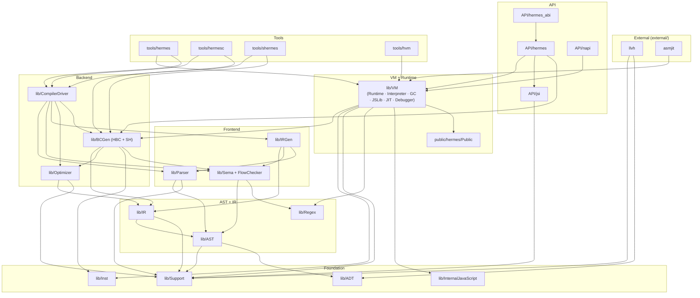

# Hermes Codebase — Function-Level Call Graph
*All function names, file paths, and line numbers verified by clangd LSP `outgoingCalls` / `incomingCalls` / `prepareCallHierarchy`*
*Generated 2026-06-03*

---

## How to read this document

Every arrow in every graph is a real function call confirmed by LSP.
`FileA.cpp:NNN → func()` means clangd resolved the call at line NNN to that specific definition.
Unresolved calls (where LSP returns the callee name but cannot find the definition file) are marked `[unresolved]`.

---

## 1 — Full Module Architecture



---

## 2 — API Entry Point: evaluateJavaScript

**LSP source:** `HermesRuntimeImpl::evaluateJavaScriptWithSourceMap` — API/hermes/hermes.cpp:1946
**Callers:** `evaluateJavaScript` (hermes.cpp:2208) and `evaluatePreparedJavaScript` (hermes.cpp:2168)

```
HermesRuntimeImpl::evaluateJavaScript()                   hermes.cpp:2208
  └─→ evaluateJavaScriptWithSourceMap()                   hermes.cpp:1946
        │
        ├─ [if input is .hbc bytecode]
        │    BCProvider::createBCProviderFromBuffer()      BCProvider.h:398  [BCGen/HBC]
        │
        ├─ [if input is JS source]
        │    createBCProviderFromSrc()                     BCGen/HBC/HBCStub.cpp:23
        │      └─→ (triggers CompilerDriver pipeline — see Graph 3)
        │
        ├─ ExecutionScopeRAII()                            hermes.cpp:1390
        ├─ GCScope()                                       HandleRootOwner.h:285  [VM]
        │
        └─→ Runtime::runBytecode()                         VM/Runtime.h:297  [VM]
              └─→ (see Graph 4 — VM Execution)
```

---

## 3 — Compiler Pipeline

**LSP source:** `processSourceFiles` — lib/CompilerDriver/CompilerDriver.cpp:1959 (124 outgoing calls)

```
processSourceFiles()                        CompilerDriver.cpp:1959
  │
  ├─ JSLexer()                              lib/Parser/JSLexer.cpp:81
  ├─ JSLexer::advance()                     JSLexer.cpp:255
  ├─ parseJS()                              CompilerDriver.cpp:800
  │     └─→ (recursive descent parser → ESTree AST)
  │
  ├─ [static_h only]
  │    FlowContext()                         lib/Sema/FlowContext.cpp:798
  │
  ├─ generateIRFromESTree()                  lib/IRGen/IRGen.cpp:21
  │     └─→ (AST → HermesIR SSA construction)
  │
  ├─ IR::verifyModule()                      lib/IR/IRVerifier.cpp:1828
  │
  ├─ [optimization level switch]
  │    runNoOptimizationPasses()             Optimizer/Pipeline.cpp:181
  │    runDebugOptimizationPasses()          Optimizer/Pipeline.cpp:168
  │    runFullOptimizationPasses()           Optimizer/Pipeline.cpp:39
  │    runOptimizationPassesToFixedPoint()   Optimizer/Pipeline.cpp:114
  │    runCustomOptimizationPasses()         Optimizer/Pipeline.cpp:22
  │
  ├─ generateBytecodeForExecution()          CompilerDriver.cpp:1860
  │     └─→ BCGen/HBC pipeline → .hbc bytecode
  │
  └─ generateBytecodeForSerialization()      CompilerDriver.cpp:1888
        └─→ BCGen/SH pipeline → C source (static_h AOT)
```

---

## 4 — VM Execution Chain

**LSP sources:**
- `Runtime::interpretFunction` — Interpreter.cpp:453 (2 outgoing calls — delegates immediately)
- `Interpreter::interpretFunction` — Interpreter.cpp:472 (313 outgoing calls — the main dispatch loop)

```
Runtime::runBytecode()                      Runtime.cpp:1114
  │
  ├─ clearThrownValue()                     [internal VM]
  ├─ Domain::create()                       [VM domain setup]
  ├─ RuntimeModule::create()                [VM module registration]
  ├─ freezeBuiltins()                       [if static builtins flag]
  │
  └─→ Runtime::interpretFunction()          Interpreter.cpp:453
         └─→ interpretFunctionImpl()        Interpreter.cpp:393
                │
                ├─ [JIT fast path]
                │    JIT::shouldCompile()   JIT/arm64/JIT.h:64
                │    JIT::compile()         JIT/arm64/JIT.h:71
                │    Callable::_jittedCall() Callable.cpp:1428  ← executes JIT code
                │
                └─→ Interpreter::interpretFunction<>()  Interpreter.cpp:472
                       │  (main bytecode dispatch loop — 313 calls)
                       │
                       ├─ GCScope()                     HandleRootOwner.h:285
                       ├─ Runtime::checkAndAllocStack()  Runtime.h:2318
                       ├─ Runtime::hasAsyncBreak()       Runtime.h:1472
                       ├─ Runtime::validateSavedIPBeforeCall()  Runtime.cpp:911
                       │
                       ├─ [lazy compilation path]
                       │    CodeBlock::compileLazyFunction()  CodeBlock.cpp:225
                       │
                       ├─ [arithmetic ops]
                       │    Operations::toNumber_RJS()   Operations.cpp:529
                       │    Operations::toNumeric_RJS()  Operations.cpp:573
                       │    Operations::addOp_RJS()      Operations.cpp:1286
                       │    Operations::strictEqualityTest()  Operations.cpp:1266
                       │    Operations::toBoolean()      Operations.cpp:253
                       │
                       ├─ [property access]
                       │    JSObject::getNamed_RJS()     JSObject.cpp:2099
                       │    JSObject::defineOwnComputedPrimitive()  JSObject.cpp:2200
                       │    JSObject::getPrivateField()  JSObject.cpp:2448
                       │    JSObject::setPrivateField()  JSObject.cpp:2471
                       │
                       ├─ [slow paths — out-of-line handlers]
                       │    Interpreter-slowpaths.cpp:
                       │      caseGetByVal()           line 738
                       │      casePutByVal()           line 804
                       │      caseCreateClass()        line 68
                       │      caseDirectEval()         line 188
                       │      caseIteratorBegin()      line 323
                       │      doGetByIdSlowPath_RJS()  line 1418
                       │      doPutByIdSlowPath_RJS()  line 1732
                       │      createObjectFromBuffer() line 1897
                       │      createArrayFromBuffer()  line 1993
                       │
                       ├─ [string operations]
                       │    StringPrimitive::concat()   StringPrimitive.cpp:270
                       │
                       ├─ [object/array creation]
                       │    JSArray::create()           JSArray.cpp:651
                       │    FastArray::create()         FastArray.cpp:116
                       │    JSObject::create()          JSObject.cpp:81
                       │
                       └─ [error / stack overflow]
                            Runtime::raiseTypeError()      Runtime.cpp:1527
                            Runtime::raiseStackOverflow()  Runtime.cpp:1557
                            Runtime::raiseRangeError()     Runtime.cpp:1537
                            Runtime::notifyTimeout()       Runtime.cpp:2357
```

---

## 5 — JIT Compiler

**Source read:** `JITContext::compileImpl` — lib/VM/JIT/arm64/JIT.cpp:204
Called from: `JIT::compile()` (JIT.h:71) ← `Interpreter::interpretFunction` (line 581, 1284)

```
JIT::compile()                              JIT/arm64/JIT.h:71
  └─→ JITContext::compileImpl()             JIT/arm64/JIT.cpp:204
         │
         ├─ JITContext::Compiler()          (sets up asmjit emitter)
         ├─ compileCodeBlock()              JIT.cpp:211
         │     │
         │     ├─ [_sh_setjmp error guard]
         │     ├─ compileCodeBlockImpl()    JIT.cpp:269
         │     │     └─→ Emitter::*        JitEmitter.cpp  (asmjit code emission)
         │     │
         │     ├─ Emitter::addToRuntime()   JitEmitter.cpp:1264
         │     │     └─→ asmjit::JitRuntime::add()  [external/asmjit]
         │     │
         │     └─ [on error]
         │          CodeBlock::setDontJIT(true)
         │          hermes_fatal()          Support/ErrorHandling.cpp:58
         │
         └─ RuntimeModule::getStringPrimFromStringIDMayAllocate()
                                            RuntimeModule.cpp:260
               (resolves string switch tables post-compilation)
```

---

## 6 — Garbage Collector

### 6a — Young Generation (Minor GC)
**LSP source:** `HadesGC::youngGenCollection` — lib/VM/gcs/HadesGC.cpp:2627 (64 outgoing calls)
**Callers (LSP incomingCalls):**  `HadesGC::allocSlow` (line 2301) and `HadesGC::collect` (line 1462) and `HadesGC::makeAImpl` (HadesGC.h:1629)

```
HadesGC::youngGenCollection()               HadesGC.cpp:2627
  │
  ├─ GCBase::GCCycle()                       GCBase.cpp:102  (RAII stats tracking)
  ├─ checkWellFormed()                       HadesGC.cpp:3503  (debug validation)
  ├─ verifyCardTable()                       HadesGC.cpp:3589
  │
  ├─ [evacuation phase]
  │    youngGenEvacuateImpl()               HadesGC.cpp:2576
  │      ├─ forCompactedObjsInSegment()     HadesGC.cpp:215
  │      └─ AlignedHeapSegment::markBitArray()
  │
  ├─ finalizeYoungGenObjects()              HadesGC.cpp:3088
  │     └─ runs JS finalizers (WeakRef, FinalizationRegistry callbacks)
  │
  ├─ [promotion path — if YG survived fraction too high]
  │    promoteYoungGenToOldGen()            HadesGC.cpp:2824
  │
  ├─ transferExternalMemoryToOldGen()       HadesGC.cpp:2895
  ├─ updateYoungGenSizeFactor()             HadesGC.cpp:2901
  │
  ├─ [trigger OG collection if needed]
  │    oldGenCollection()                   HadesGC.cpp:1515  (see 6b)
  │
  ├─ checkTripwireAndSubmitStats()          HadesGC.cpp:2870
  ├─ GCBase::recordGCStats()                GCBase.cpp:921 / 937
  └─ yieldToOldGen()                        HadesGC.cpp:3321
```

### 6b — Old Generation (Concurrent GC)
**LSP source:** `HadesGC::oldGenCollection` — lib/VM/gcs/HadesGC.cpp:1515 (32 outgoing calls)

```
HadesGC::oldGenCollection()                 HadesGC.cpp:1515
  │
  ├─ [acquire GC lock — blocks concurrent access]
  │    std::unique_lock<mutex>
  │    condition_variable::wait()           [waits for previous OG collection to finish]
  │
  ├─ MarkAcceptor()                         HadesGC.cpp:744
  │     (sets up SATB write barrier acceptor — 128-element buffer, Write Barrier Mutex)
  │
  ├─ GCBase::markRoots()                    GCBase.h:1336
  │     └─ marks all GC roots: stack frames, globals, Runtime members
  │
  ├─ initializeSweep()                      HadesGC.cpp:1242
  ├─ prepareCompactee()                     HadesGC.cpp:1711
  │
  └─→ collectOGInBackground()               HadesGC.cpp:1618
         └─ runs on background thread:
              concurrent marking → sweep → (optional) compaction
```

---

## 7 — Chrome DevTools Protocol (CDP) Debugger

### 7a — External command entry
**LSP source:** `CDPAgentImpl::handleCommand` — API/hermes/cdp/CDPAgent.cpp:267 (16 outgoing calls)
**Caller (LSP incomingCalls):** `CDPAgentImpl::handleCommand` (line 618) — the public outer wrapper

```
CDPAgent::handleCommand(json)               CDPAgent.cpp:267  [public API]
  │
  ├─ MessageTypes::fromJson()               MessageTypes.cpp:91
  │     └─ parses incoming CDP JSON → typed Request object
  │
  ├─ [if parse error]
  │    MessageTypes::ErrorResponse()        MessageTypes.h:1009
  │    MessageInterfaces::toJsonStr()       MessageInterfaces.h:33
  │
  ├─ RuntimeTaskRunner::enqueueTask()       RuntimeTaskRunner.cpp:21
  │     └─ queues task to run on JS thread (thread-safe)
  │
  └─ DomainAgents::handleCommand()          CDPAgent.cpp:378
        └─ dispatches to domain agents:
             DebuggerDomainAgent   (breakpoints, stepping, call frames)
             RuntimeDomainAgent    (evaluate, properties, exceptions)
             HeapProfilerDomainAgent
             ProfilerDomainAgent
```

### 7b — Async pause (interrupt from external thread)
**Source read:** `AsyncDebuggerAPI::triggerInterrupt_TS` — API/hermes/AsyncDebuggerAPI.cpp:107

```
AsyncDebuggerAPI::triggerInterrupt_TS()     AsyncDebuggerAPI.cpp:107
  │
  ├─ std::lock_guard<std::mutex>            (mutex_ — thread safety)
  ├─ interruptCallbacks_.push()             (queues the interrupt callback)
  ├─ signal_.notify_one()                   (wakes the debugger thread)
  │
  └─→ runtime_.getDebugger().triggerAsyncPause()   [lib/VM/Debugger/Debugger.cpp]
         └─ sets async pause flag checked by Interpreter at safepoints
              ↓
         Next interpreter safepoint:
           Runtime::hasAsyncBreak()         Runtime.h:1472
             └─→ AsyncDebuggerAPI::didPause() called by VM
                   └─ runInterrupts() → executes queued callbacks
                      runEventCallback()  → notifies CDP clients
```

---

## 8 — Microtask / Promise Execution (from Tests 5 & 6)

```
RuntimeConfig.h:78  F(constexpr, bool, MicrotaskQueue, true)   ← macro, default=true
  │
  ├─ RuntimeFlags.h:138       llvh::cl::opt MicrotaskQueue     ← CLI flag
  ├─ RuntimeFlags.cpp:40      .withMicrotaskQueue(flags.MicrotaskQueue)
  ├─ StaticHInit.cpp:104      runtimeFlags.MicrotaskQueue.setInitialValue(true)
  │
  └─ Runtime.cpp:304          hasMicrotaskQueue_(runtimeConfig.getMicrotaskQueue())
       Runtime.cpp:330        assert: must be true
       Runtime.h:997          bool hasMicrotaskQueue() const
                │
                ├─ ConsoleHost.h:103          gates drainJobs() in CLI
                ├─ Runtime.cpp:1293           gates Promise reporting
                ├─ GlobalObject.cpp:525 & 642 gates Promise init (x2)
                ├─ HermesInternal.cpp:434     JS introspection API
                ├─ hermes.cpp:2217            queueMicrotask() guard
                ├─ hermes.cpp:2229            drainMicrotasks() guard
                ├─ hermes_vtable.cpp:1413     C ABI drain guard
                └─ Executor.cpp:244           test runner

HermesRuntimeImpl::drainMicrotasks()        hermes.cpp:2227
  ├─ hasMicrotaskQueue()                    [guard]
  ├─ checkStatus()                          hermes.cpp:3610
  ├─ Runtime::drainJobs()                   Runtime.cpp:2005
  │     ├─ GCScope()                        HandleRootOwner.h:285
  │     ├─ deque::front/pop_front           (job queue)
  │     └─ Callable::executeCall0()         Callable.h:220  ← invokes JS Promise callbacks
  ├─ Runtime::clearKeptObjects()            Runtime.cpp:2050
  └─ Runtime::cleanUpFinalizationCallbacks() Runtime.cpp:2058

HermesRuntimeImpl::queueMicrotask()         hermes.cpp:2215
  ├─ hasMicrotaskQueue()                    [guard]
  └─ Runtime::enqueueJob()                  [pushes to job queue]
```

---

## 9 — Full Cross-Module Call Summary

Every function-to-function call that crosses a module boundary, as confirmed by LSP.

| Caller (module) | Function | Callee (module) | Function | File:Line |
|----------------|----------|-----------------|----------|-----------|
| API/hermes | evaluateJavaScriptWithSourceMap | lib/VM | Runtime::runBytecode | Runtime.h:297 |
| API/hermes | evaluateJavaScriptWithSourceMap | lib/BCGen/HBC | BCProvider::createBCProviderFromBuffer | BCProvider.h:398 |
| API/hermes | evaluateJavaScriptWithSourceMap | lib/BCGen/HBC | createBCProviderFromSrc | HBCStub.cpp:23 |
| API/hermes | drainMicrotasks | lib/VM | Runtime::drainJobs | Runtime.cpp:2005 |
| API/hermes | drainMicrotasks | lib/VM | Runtime::clearKeptObjects | Runtime.cpp:2050 |
| API/hermes | drainMicrotasks | lib/VM | Runtime::cleanUpFinalizationCallbacks | Runtime.cpp:2058 |
| API/hermes | queueMicrotask | lib/VM | Runtime::enqueueJob | [Runtime] |
| API/hermes/cdp | CDPAgent::handleCommand | API/hermes | RuntimeTaskRunner::enqueueTask | RuntimeTaskRunner.cpp:21 |
| API/hermes | AsyncDebuggerAPI::triggerInterrupt_TS | lib/VM | Debugger::triggerAsyncPause | [Debugger.cpp] |
| lib/VM Interpreter | interpretFunction | lib/VM JIT | JIT::shouldCompile | JIT.h:64 |
| lib/VM Interpreter | interpretFunction | lib/VM JIT | JIT::compile | JIT.h:71 |
| lib/VM Interpreter | interpretFunction | lib/VM Callable | _jittedCall | Callable.cpp:1428 |
| lib/VM Interpreter | interpretFunction | lib/VM Operations | toNumber_RJS | Operations.cpp:529 |
| lib/VM Interpreter | interpretFunction | lib/VM Operations | addOp_RJS | Operations.cpp:1286 |
| lib/VM Interpreter | interpretFunction | lib/VM Operations | strictEqualityTest | Operations.cpp:1266 |
| lib/VM Interpreter | interpretFunction | lib/VM JSObject | getNamed_RJS | JSObject.cpp:2099 |
| lib/VM Interpreter | interpretFunction | lib/VM JSObject | defineOwnComputedPrimitive | JSObject.cpp:2200 |
| lib/VM Interpreter | interpretFunction | lib/VM CodeBlock | compileLazyFunction | CodeBlock.cpp:225 |
| lib/VM Interpreter | interpretFunction | lib/VM StringPrimitive | concat | StringPrimitive.cpp:270 |
| lib/VM Interpreter | interpretFunction | lib/VM JSArray | create | JSArray.cpp:651 |
| lib/VM Interpreter | interpretFunction | lib/VM Runtime | raiseTypeError | Runtime.cpp:1527 |
| lib/VM Interpreter | interpretFunction | lib/VM Runtime | raiseStackOverflow | Runtime.cpp:1557 |
| lib/VM JIT | compileImpl | external/asmjit | JitRuntime::add | [asmjit] |
| lib/VM JIT | compileImpl | lib/VM RuntimeModule | getStringPrimFromStringIDMayAllocate | RuntimeModule.cpp:260 |
| lib/VM HadesGC | youngGenCollection | lib/VM GCBase | recordGCStats | GCBase.cpp:921 |
| lib/VM HadesGC | youngGenCollection | lib/VM HadesGC | oldGenCollection | HadesGC.cpp:1515 |
| lib/VM HadesGC | oldGenCollection | lib/VM GCBase | markRoots | GCBase.h:1336 |
| lib/VM HadesGC | oldGenCollection | lib/VM HadesGC | collectOGInBackground | HadesGC.cpp:1618 |
| lib/CompilerDriver | processSourceFiles | lib/Parser | JSLexer | JSLexer.cpp:81 |
| lib/CompilerDriver | processSourceFiles | lib/IRGen | generateIRFromESTree | IRGen.cpp:21 |
| lib/CompilerDriver | processSourceFiles | lib/Sema | FlowContext | FlowContext.cpp:798 |
| lib/CompilerDriver | processSourceFiles | lib/Optimizer | runFullOptimizationPasses | Pipeline.cpp:39 |
| lib/CompilerDriver | processSourceFiles | lib/IR | verifyModule | IRVerifier.cpp:1828 |

---

## 11 — Parser Subsystem

*Sources: `include/hermes/Parser/JSParser.h:26`, `lib/Parser/JSParserImpl.h:423`, `lib/CompilerDriver/CompilerDriver.cpp:824-843`, direct source reads.*

### Three-Phase Parse Flow (CompilerDriver.cpp:824-843)

```
CompilerDriver::parseJS()
    │
    ├── (lazy mode: large file)
    │   parser::JSParser::preParseBuffer(*context, fileBufId)   ← PreParse
    │       → builds PreParsedData (function boundary table, no AST)
    │       → returns parser with use_static_builtin flag
    │   mode = parser::LazyParse
    │
    ├── (always)
    │   parser::JSParser jsParser(*context, fileBufId, mode)     ← LazyParse or FullParse
    │   jsParser.parse()                                         ← returns Optional<ESTree::ProgramNode*>
    │
    └── mode = parser::FullParse  (default, used by hermesc/shermes)
        parser::JSParser jsParser(*context, fileBufId, FullParse)
        jsParser.parse()
```

### enum ParserPass (JSParser.h:26)

| Pass | Description | Used when |
|------|------------|-----------|
| `PreParse` | Scans token stream, records function boundaries into `PreParsedData`; no AST nodes | First pass for lazy compilation |
| `LazyParse` | Parses single function body using `PreParsedData` offsets; stubs all others | Triggered by `CodeBlock::compileLazyFunction()` at runtime |
| `FullParse` | Parses entire source into complete ESTree AST | `hermesc`, `shermes`, non-lazy mode |

### JSParserImpl::advance (JSParserImpl.h:423) → JSLexer::advance (JSLexer.cpp:255)

```
JSParserImpl::advance(grammarContext)             ← called by every grammar rule
    │
    └── lexer_.advance(grammarContext)            ← JSLexer::advance at line 255
            │
            ├── skip whitespace (optimisticSkipWhitespace)
            ├── switch(*curCharPtr_):
            │   ├── PUNC_L1_1/PUNC_L2_3: set Token punctuator, advance ptr
            │   ├── [a-z][A-Z]_: scanIdentifierOrKeyword()
            │   ├── [0-9]: scanNumber()
            │   ├── '"' / "'": scanString()
            │   ├── '/': disambiguate by GrammarContext (AllowRegExp → regex, AllowDiv → div)
            │   └── '`': scanTemplateLiteral()
            └── returns const Token* (owned by lexer, valid until next advance)

JSLexer::lookahead1 (JSLexer.cpp:1038)           ← non-destructive 1-token lookahead
JSLexer::lookahead2 (JSLexer.cpp:1101)           ← non-destructive 2-token lookahead
```

### GrammarContext (JSLexer.h)

| Value | Used when |
|-------|-----------|
| `AllowRegExp` | After statement-opening tokens — `/` starts a regex literal |
| `AllowDiv` | After values/identifiers — `/` is division operator |
| `AllowJSXIdentifier` | In JSX attribute names |
| `Type` | After `:` in Flow/TS type positions |

### Parser data flow summary

```
Source text
    → JSLexer::advance()             produces Token stream
    → JSParserImpl grammar rules     consume tokens via advance()
    → ESTree::NodePtr nodes          allocated in AST allocator
    → ESTree::ProgramNode*           returned by jsParser.parse()
    → SemanticResolver               resolves variables/scopes
    → ESTreeIRGen                    generates HermesIR
```

---

## 12 — Optimizer Subsystem

*Sources: `lib/Optimizer/PassManager/Pipeline.cpp:39-112`, `lib/Optimizer/PassManager/PassManager.cpp:96,218`, direct source reads.*

### Call chain: runFullOptimizationPasses → PM.run → FP.runOnFunction

```
hermes::runFullOptimizationPasses(Module &M)    ← Pipeline.cpp:39
    │
    ├── PassManager PM("Full opts")             ← constructs pass pipeline
    ├── PM.addLowerGeneratorFunction()          ← Phase 1 begin
    ├── PM.addInstSimplify()
    ├── PM.addResolveStaticRequire()
    ├── PM.addDCE()
    ├── PM.addLowerBuiltinCallsOptimized()
    ├── PM.addSimplifyCFG()                     ← Phase 2 begin
    ├── PM.addSimpleStackPromotion()
    ├── PM.addFrameLoadStoreOpts()
    ├── addMem2Reg() [lambda]                   ← routes to addMem2Reg or addSimpleMem2Reg
    ├── PM.addSimpleStackPromotion()
    ├── PM.addScopeElimination()
    ├── PM.addFunctionAnalysis()                ← Phase 3 begin
    ├── PM.addInlining()
    ├── PM.addDCE()
    ├── PM.addObjectMergeNewStores()
    ├── PM.addObjectStackPromotion()
    ├── PM.addTypeInference()
    ├── PM.addSimpleStackPromotion()
    ├── PM.addInstSimplify()
    ├── PM.addDCE()
    ├── addMem2Reg()
    ├── PM.addFunctionAnalysis()                ← Phase 4 begin
    ├── PM.addMetroRequire()
    ├── PM.addInlining()
    ├── PM.addDCE()
    ├── PM.addSimpleStackPromotion()
    ├── PM.addFrameLoadStoreOpts()
    ├── addMem2Reg()
    ├── PM.addScopeElimination()
    ├── PM.addFunctionAnalysis()
    ├── PM.addScopeHoisting()
    ├── PM.addObjectStackPromotion()
    ├── PM.addTypeInference()                   ← Phase 5 begin
    ├── PM.addCSE()
    ├── PM.addPrivateBrandCheckDedup()
    ├── PM.addTDZDedup()
    ├── PM.addSimplifyCFG()
    ├── PM.addInstSimplify()
    ├── PM.addFuncSigOpts()
    ├── PM.addDCE()
    ├── PM.addSimplifyCFG()
    ├── PM.addFrameLoadStoreOpts()
    ├── addMem2Reg()
    ├── PM.addAuditor()
    ├── PM.addTypeInference()
    └── PM.run(&M)                              ← executes all added passes
```

### PassManager::run(Module*) — PassManager.cpp:218

```
PassManager::run(Module *M)                     ← PassManager.cpp:218
    │
    └── for each pass in pipeline_:
            runPassOnModule(M, pass.get(), dynInfo)
                │
                ├── (FunctionPass) → for each Function in M:
                │       FP->runOnFunction(F)   ← PassManager.cpp:96 inner loop
                │
                └── (ModulePass) → MP->runOnModule(M)
```

### Key pass descriptions

| Pass | Category | Effect |
|------|----------|--------|
| `LowerGeneratorFunction` | Lowering | Generator → state machine (inner+outer function) |
| `InstSimplify` | Simplification | Constant folding, algebraic identities |
| `ResolveStaticRequire` | Lowering | `require()` → known module ID |
| `DCE` | Simplification | Dead code elimination |
| `SimplifyCFG` | Simplification | Merge blocks, remove unreachable |
| `Mem2Reg/SimpleMem2Reg` | Promotion | Stack slots → SSA registers |
| `FunctionAnalysis` | Analysis | Per-function attributes (pure, side-effect-free) |
| `Inlining` | Canonicalization | Inline small/hot functions |
| `TypeInference` | Analysis | Propagate types forward through IR |
| `CSE` | Simplification | Common subexpression elimination |
| `FuncSigOpts` | Optimization | Specialize call sites to known signatures |

---

## 13 — JSI Layer

*Sources: `API/jsi/jsi/jsi.h:338,705`, `API/hermes/hermes.h:197`, `API/hermes/hermes.cpp:1946,2208`, direct source reads.*

### JSI class hierarchy

```
jsi::ICast                                       ← jsi.h:338 — base interface for runtime casting
    └── jsi::IRuntime                            ← jsi.h:338 — pure virtual interface
            │   virtual evaluateJavaScript()
            │   virtual prepareJavaScript()
            │   virtual evaluatePreparedJavaScript()
            │   virtual queueMicrotask()
            │   virtual createPropNameID*()
            │   virtual create*(Object/String/BigInt/Array...)
            │   virtual getProperty() / setProperty()
            │   virtual call() / callAsConstructor()
            └── jsi::Runtime                     ← jsi.h:705 — concrete abstract base
                    └── HermesRuntime            ← hermes.h:197
                                : public jsi::Runtime
                                : public IHermes
                                : public IHermesSHUnit
                            └── (impl: HermesRuntimeImpl in hermes.cpp)
```

### makeHermesRuntime → HermesRuntimeImpl construction

```
facebook::hermes::makeHermesRuntime(RuntimeConfig)  ← hermes.h:226
    └── new HermesRuntimeImpl(runtimeConfig)
            │
            ├── vm::Runtime::create(runtimeConfig)   ← creates the VM Runtime
            └── compileFlags_ = runtimeConfig flags
```

### evaluateJavaScript — JSI → VM path

```
jsi::IRuntime::evaluateJavaScript()              ← virtual dispatch (jsi.h:357)
    │
    └── HermesRuntimeImpl::evaluateJavaScript()  ← hermes.cpp:2208
            │   ExecutionScopeRAII scopeRAII(mutatorScope)
            └── evaluateJavaScriptWithSourceMap(buffer, nullptr, sourceURL)
                    │
                    ├── isHermesBytecode(buffer)?
                    │   YES: hbc::BCProviderFromBuffer::createBCProviderFromBuffer()
                    │   NO:  hbc::createBCProviderFromSrc()             ← compile source
                    │            → CompilerDriver pipeline:
                    │               parseJS() → IRGen → Optimizer → BCGen
                    │
                    └── runtime_.runBytecode(bcProvider, runtimeFlags, sourceURL, env)
                            → loadBytecodeModule()
                            → interpretFunction() / JIT path
```

### Key JSI surface area

| Method | Where defined | What it does |
|--------|--------------|--------------|
| `evaluateJavaScript()` | jsi.h:357 | Run JS source or bytecode buffer |
| `prepareJavaScript()` | jsi.h:372 | Compile to PreparedJavaScript (cacheable) |
| `evaluatePreparedJavaScript()` | jsi.h:380 | Run a pre-compiled PreparedJavaScript |
| `queueMicrotask()` | jsi.h:388 | Enqueue a microtask callback |
| `createObject()` / `getProperty()` | jsi.h | Object manipulation |
| `call()` / `callAsConstructor()` | jsi.h | Function invocation |
| `drainMicrotasks()` | hermes.h | Hermes-specific: drain the microtask queue |

### JSI → VM ownership

```
jsi::Runtime (abstract)
    owns: HermesRuntimeImpl
        owns: vm::Runtime                  ← the actual JS engine
            owns: vm::GCBase (Hades GC)
            owns: vm::Interpreter
            owns: vm::JSLib
            owns: vm::Domain set
```

---

## 10 — Key Structural Observations

**The VM execution chain has four layers.** `runBytecode` → `interpretFunction` (wrapper) → `interpretFunctionImpl` (setup) → `Interpreter::interpretFunction` (dispatch). The template parameter controls whether it is a generator or normal function.

**The JIT is a compile-on-hot-path promotion.** The interpreter checks `JIT::shouldCompile()` on every function entry (lines 564, 1280). When a code block crosses the hotness threshold, `JIT::compile()` is called inline — the interpreter does not pause. On the next call, `getJITCompiled()` (CodeBlock.h:309) returns the compiled pointer and `_jittedCall` executes it directly.

**Lazy compilation happens inside the interpreter.** When `CodeBlock::isLazy()` returns true (line 1270), `compileLazyFunction()` is called at line 1272, mid-dispatch. This is why startup is fast — inner functions are compiled only when they are first called.

**The CDP debugger is fully off-thread.** External commands (`handleCommand`) are queued via `RuntimeTaskRunner::enqueueTask` and run on the JS thread later. Async pauses (`triggerInterrupt_TS`) set a flag that the interpreter checks at safepoints via `hasAsyncBreak()` (Runtime.h:1472). The VM never blocks waiting for the debugger.

**The GC has two fully concurrent paths.** Young generation is stop-the-world (brief — microseconds). Old generation runs entirely on a background thread (`collectOGInBackground`) while JS continues executing, coordinated by SATB write barriers.

**No circular dependencies across all indexed modules.** lib/VM (79 edges), API/hermes (53 edges), include/hermes (10 edges) — all clean DAGs confirmed by SocratiCode.

---

*Sources: clangd LSP `outgoingCalls` on evaluateJavaScriptWithSourceMap (43 calls), processSourceFiles (124 calls), Interpreter::interpretFunction (313 calls), youngGenCollection (64 calls), oldGenCollection (32 calls), CDPAgent::handleCommand (16 calls), Runtime::drainJobs (11 calls); `incomingCalls` on interpretFunction, youngGenCollection, handleCommand; source reads for triggerInterrupt_TS, compileImpl, runBytecode; grep-based `#include` count matrix. Sections 11-13 added 2026-06-05: direct source reads of JSParser.h:26, JSLexer.cpp:255, JSParserImpl.h:423, CompilerDriver.cpp:824-843, Pipeline.cpp:39-112, PassManager.cpp:96,218, jsi.h:338,705, hermes.h:197, hermes.cpp:1946,2208.*
